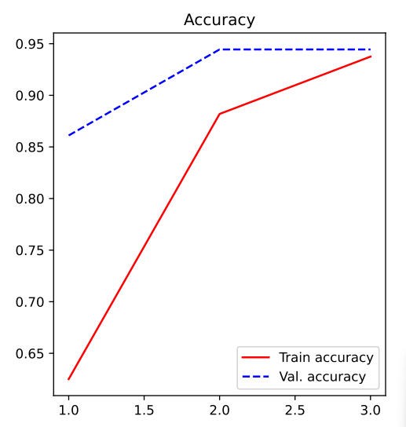
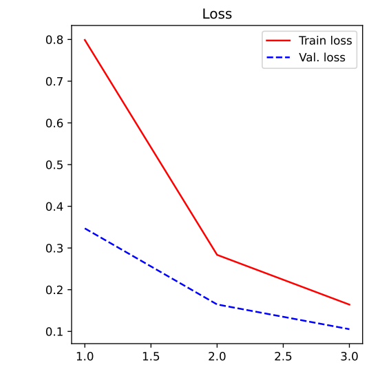
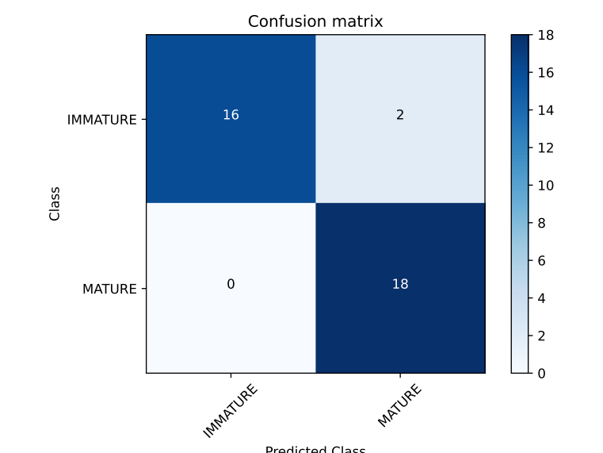
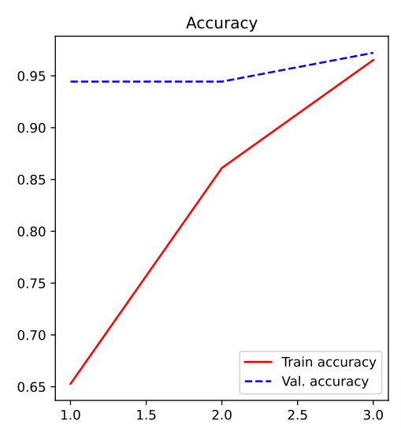
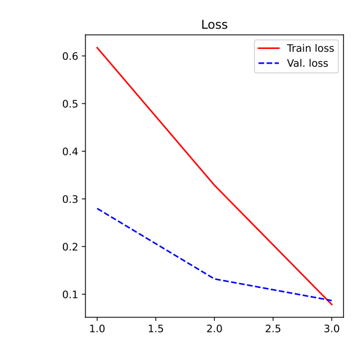
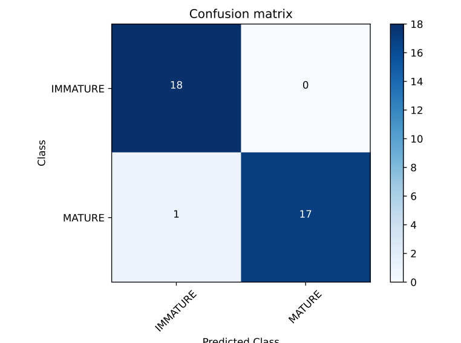

<h1 align=center>Universidade Federal de Viçosa</h1>

<i>Campus</i> Rio Paranaíba  Curso: Sistemas de Informação   Disciplina SIN 323 - Inteligência Artificial

 

<h1 align=center>Técnicas de aprendizado de máquina aplicadas na classificação da maturação de grãos de café </h1>

<h1 align=center>Autores</h1>

   Carlos Eduardo Maximo - 6962  Ronald Augusto Domingos Silva - 7024   Augusto de Faria Pereira - 7556

  

<h3>1. Objetivo:</h3>

O presente trabalho tem como objetivo desenvolver um sistema de visão para classificação de grãos de café entre maduros e verdes. Propõe-se a implementação de técnicas avançadas de processamento de imagens e aprendizado de máquina para avaliar a maturação dos grãos de café, buscando a classificação automática em "maduros" ou "imaturos". O modelo de aprendizado de máquina será baseado em técnicas de visão computacional.O objetivo central é fornecer uma ferramenta precisa e objetiva aos produtores para avaliar a qualidade dos grãos em tempo real. Isso contribuirá para otimizar o processo de seleção, melhorar a produção

<h3>2. Como rodar o projeto: </h3>
<li>
O projeto foi feito com a linguagem de programação <strong>Python</strong> na sua versão <strong>3.8.10</strong>

<a href="https://www.python.org/downloads/release/python-3810/">Download Python</a>
</li>

<li>
  Após a instalação do Python em sua versão 3.8.10, faça o clone do repositório para sua máquina com o comando:
  <pre align=center>git clone https://github.com/Carlosmax1/maturacao-cafe.git</pre>
</li>
 
<li>
  Dentro a pasta onde foi clonado o repositório abra o terminal e digite o comando para instalar todas as dependências.
  <pre align=center>!pip install -r requirements.txt</pre>
</li>
 
<li>
Em seguida, rode o script <strong style="font-style: italic;">treatment.py</strong> para separação do dataset para treino e teste 
 <pre align=center>python3 treatment.py</pre>
</li>
 
<li>
  Após concluir os passos anteriores, basta executar o <strong style="font-style: italic;">main.py</strong> para treinar a IA. Os relatórios do treinamento serão armazenados na pasta outputs
  <pre align=center>python3 main.py</pre>
</li>
<li>
Caso queria rodar no 
</li>
 

<h3>3. Resultados:</h3>

Este estudo investigou o desempenho das redes neurais VGG16 e AlexNet, concentrando-se na avaliação sistemática do impacto do treinamento nas métricas de acurácia de validação em arquiteturas distintas de redes neurais convolucionais (CNN). Os resultados são analisados considerando a evolução dessas métricas ao longo do processo de treinamento.
<h4>A. AlexNet</h4>
Durante o treinamento da AlexNet, observamos uma melhoria significativa ao longo de três épocas. Inicialmente, a perda de treinamento foi de 0.7989, com uma acurácia de 62.50%. Ao término das três épocas, a perda de treinamento reduziu para 0.1643, alcançando uma acurácia de 93.75%.

Na fase de validação, a perda inicial foi de 0.3470, com uma acurácia de 86,11%, evoluindo para 0.1054 de perda e 94,44% de acurácia.

A matriz de confusão revelou que o modelo classificou corretamente os grãos maduros e imaturos, atingindo uma precisão global de 94,44%.

<h3>B. VGG16</h3>

O treinamento da VGG16 também apresentou uma evolução notável ao longo de três épocas. Inicialmente, a perda de treinamento foi de 0.6173, com uma acurácia de 65.28\%, atingindo uma perda final de 0.0785 e uma acurácia de 96.53

Na validação, a perda inicial foi de 0.2799, com uma acurácia de 94.44%, evoluindo para 0.0868 de perda e 97.22% de acurácia.

A matriz de confusão indicou um desempenho excepcional, com 100% de precisão na classificação de ambos os tipos de grãos. O modelo VGG16 demonstrou uma precisão global de 97.22

 

<h3>4. Conclusão:</h3>

Em conclusão, o presente estudo explorou a aplicação de técnicas avançadas de processamento de imagens e aprendizado de máquina para a classificação de grãos de café entre maduros e verdes. A implementação das redes neurais convolucionais AlexNet e VGG16 revelou resultados promissores, destacando a capacidade desses modelos em proporcionar uma avaliação precisa da maturação dos grãos.

Ao longo do treinamento, ambas as arquiteturas demonstraram uma notável capacidade de aprendizado, refletida na evolução das métricas de desempenho. A análise das matrizes de confusão destacou a eficácia dos modelos na classificação correta dos grãos, oferecendo uma ferramenta confiável para produtores avaliarem a qualidade dos grãos em tempo real.

É importante ressaltar que a escolha entre as arquiteturas AlexNet e VGG16 pode depender de considerações específicas, como requisitos de desempenho e recursos computacionais disponíveis. Ambas as abordagens representam soluções viáveis para a tarefa de classificação proposta, com a VGG16 demonstrando um desempenho ligeiramente superior na precisão global.

